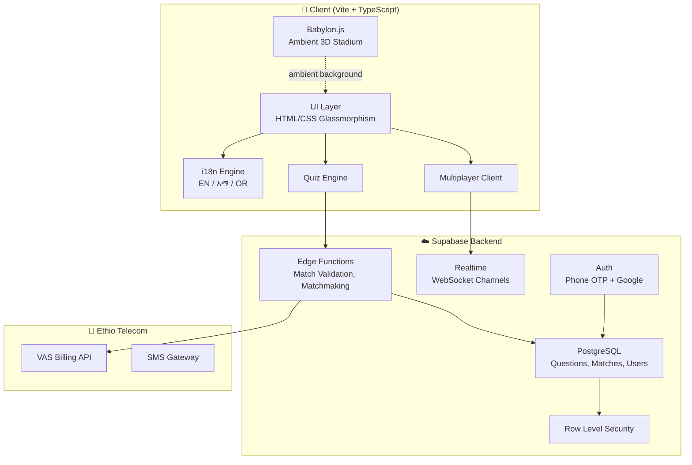
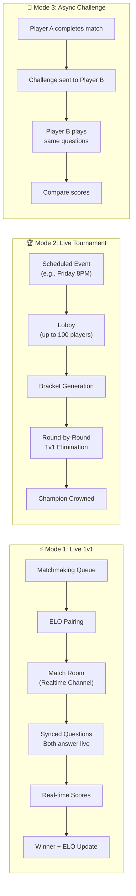
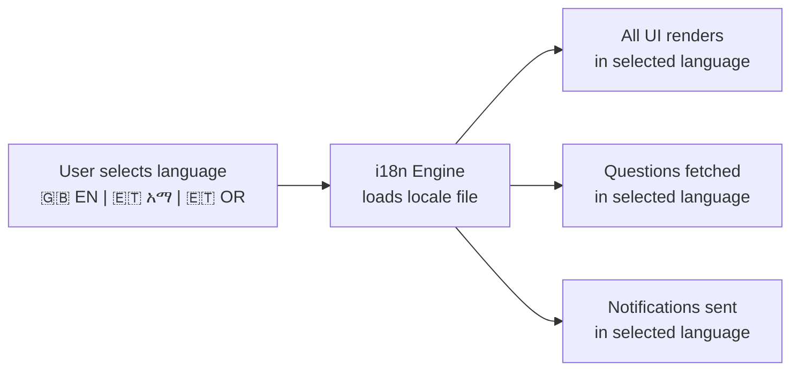
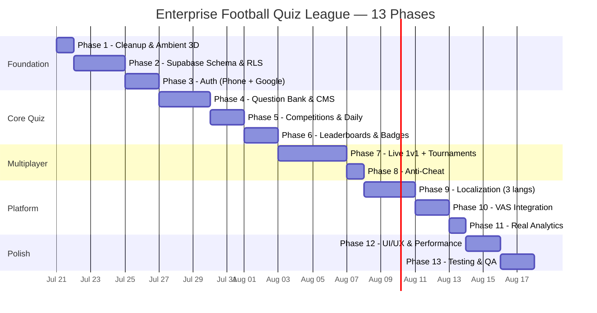

# Enterprise-Grade Football Quiz League — Implementation Plan v2

> **All open questions resolved. Ready for execution approval.**

---

## Decisions Locked In

| Decision | Choice |
|:---|:---|
| **Babylon.js** | ✅ **Option B — Keep** as ambient 3D stadium background |
| **Backend** | Supabase (Auth, Database, Realtime, Edge Functions) |
| **Question Source** | Full CMS-driven — no existing database, build from scratch |
| **Multiplayer** | ✅ **Yes — Live + Async** (detailed architecture below) |
| **Localization** | End-to-end **Amharic (አማርኛ)** + **Afan Oromo** + English |
| **Target Platform** | Mobile-primary, web-adaptive |

---

## User Review Required

> [!IMPORTANT]
> **Multiplayer Architecture**: Review the three multiplayer modes below (Live 1v1, Live Tournaments, Async Challenges). The Live 1v1 system uses Supabase Realtime WebSocket channels with ELO-based matchmaking. Confirm this approach works for your expected user scale.

> [!WARNING]
> **Supabase Realtime Limits**: The free tier supports 200 concurrent connections. For a production VAS platform with 100K+ users, you'll need the Pro plan ($25/mo) which supports 500 concurrent + overages. Confirm Supabase plan tier before multiplayer goes live.

> [!IMPORTANT]
> **Localization Scope**: Full Amharic and Afan Oromo means ALL UI text, ALL questions, ALL notifications, ALL admin CMS labels. This triples the content work. I'll build the i18n system and English UI first, then you/translators populate the Amharic and Afan Oromo strings. Questions will need to be authored in all 3 languages per entry.

---

## Architecture Overview



---

## Multiplayer Architecture — Deep Dive

### Three Multiplayer Modes



---

### Mode 1: Live 1v1 Head-to-Head (Primary Mode)

**How it works — step by step:**

1. **Player taps "⚡ Live Match"** → Client sends `join_queue` to Supabase Edge Function
2. **Matchmaking (Edge Function)**:
   - Player added to `matchmaking_queue` table with their ELO rating
   - Edge Function runs every 2 seconds, pairing players within ±150 ELO range
   - If no match found in 15 seconds, range widens to ±300
   - If still no match at 30 seconds, offer AI opponent option
3. **Match Created**:
   - Edge Function creates `live_match` row with 10 pre-selected questions
   - Both players subscribe to Supabase Realtime channel: `match:{matchId}`
   - Both receive `MATCH_FOUND` broadcast with opponent info
4. **Synced Question Flow**:
   - Server broadcasts `QUESTION` event with question data (no correct answer sent!)
   - Both players see same question simultaneously
   - 15-second timer per question (shorter than solo for intensity)
   - Player submits answer → Edge Function validates → broadcasts `ANSWER_RESULT` to both
   - Both players see each other's answer and running score in real-time
5. **Match End**:
   - After all questions → server calculates winner
   - ELO ratings updated: `K-factor = 32, new_elo = old_elo + K * (actual - expected)`
   - Coins/XP awarded (winner gets 2x bonus)
   - Both players see full-time stats comparison

**Technical implementation:**

```
Supabase Realtime Channel: match:{matchId}

Events (Server → Client):
  MATCH_FOUND      { opponent: {name, rank, elo}, startsIn: 5 }
  QUESTION         { index: 1, prompt, options, timeLimit: 15 }
  OPPONENT_ANSWERED { responseTime: 3.2 }  // no answer revealed yet
  QUESTION_RESULT  { correctIndex: 2, yourAnswer: 2, opponentAnswer: 0,
                     yourScore: 150, opponentScore: 100 }
  MATCH_COMPLETE   { winner: "player_a", finalScore: {a: 800, b: 600},
                     eloChange: +18, coins: 500, xp: 120 }

Events (Client → Server via Edge Function):
  SUBMIT_ANSWER    { matchId, questionIndex, selectedIndex, responseTimeMs }
```

#### [NEW] `src/networking/multiplayer/MatchmakingService.ts`
- `joinQueue(competitionId?): Promise<void>` — Enter matchmaking
- `leaveQueue(): void` — Cancel search
- `onMatchFound(callback): void` — Listen for pairing
- ELO range expansion over time
- Queue status UI updates (searching... 5s... 10s...)

#### [NEW] `src/networking/multiplayer/LiveMatchClient.ts`
- Manages Supabase Realtime channel subscription for a live match
- `subscribeToMatch(matchId): void`
- `submitAnswer(questionIndex, selectedIndex, responseTimeMs): void`
- Event handlers: `onQuestion`, `onOpponentAnswered`, `onQuestionResult`, `onMatchComplete`
- Connection recovery: auto-reconnect on drop, server holds state for 30 seconds
- Forfeit detection: if player disconnects for >30 seconds, auto-forfeit

#### [NEW] `src/networking/multiplayer/ELORatingSystem.ts`
- Standard ELO with K-factor 32
- Initial rating: 1200
- `calculateNewRatings(winnerElo, loserElo, isDraw): {winner: number, loser: number}`
- Rating floors (minimum 100, no negative)

#### [NEW] `src/ui/screens/LiveMatchScreen.ts`
- Split-screen scoreboard: You vs Opponent
- Both players' names, ranks, avatars at top
- Real-time score comparison bar
- Opponent answer indicator (answered/waiting) without revealing their choice
- Question timer (15 seconds, more intense than solo)
- Post-question comparison: both answers revealed side-by-side
- Full-time comparison stats

#### [NEW] `src/ui/screens/MatchmakingScreen.ts`
- Searching animation (radar sweep / pulsing football)
- "Finding worthy opponent..." → "Opponent found!" transition
- Opponent preview card (name, rank, ELO, win rate)
- 5-second countdown before match starts

#### [NEW] `supabase/functions/matchmaking/index.ts`
- Edge Function: processes matchmaking queue every 2 seconds
- Pairs players by ELO proximity within same competition
- Creates `live_match` record with pre-selected questions
- Sends `MATCH_FOUND` to both players via Realtime broadcast

#### [NEW] `supabase/functions/live-match/index.ts`
- Edge Function: handles answer submissions during live matches
- Validates answers server-side (anti-cheat)
- Broadcasts results to both players
- Manages question timing and match state
- Calculates final results and ELO updates

---

### Mode 2: Live Tournaments (Scheduled Events)

**How it works:**

1. **Admin schedules tournament** via CMS: "Champions League Friday Night — 8PM EAT"
2. **Players register** up to 1 hour before start (max 64/128 players)
3. **At start time**, bracket is generated (seeded by ELO)
4. **Round 1**: All first-round 1v1 matches run simultaneously
5. **Winners advance** → Round 2, 3, ... → Final
6. **Champion crowned** with bonus coins/XP and exclusive badge

#### [NEW] `src/core/competition/TournamentManager.ts`
- Tournament lifecycle: `REGISTRATION` → `IN_PROGRESS` → `COMPLETED`
- Bracket generation (single elimination, seeded by ELO)
- Round management with auto-advance
- Bye allocation for non-power-of-2 player counts

#### [NEW] `src/ui/screens/TournamentLobbyScreen.ts`
- Registration countdown, player list, bracket preview
- Live bracket visualization during tournament
- Round results and next match countdown

#### [NEW] `supabase/functions/tournament/index.ts`
- Bracket generation, round advancement, results aggregation

---

### Mode 3: Async Challenges (Play Anytime)

**How it works:**

1. Player A completes a solo match → taps "Challenge a Friend"
2. Selects friend from contacts/leaderboard → challenge sent
3. Player B receives notification → plays same 10 questions
4. Both scores compared → winner declared → both notified

#### [NEW] `src/networking/multiplayer/ChallengeService.ts`
- `sendChallenge(matchId, opponentUserId): Promise<void>`
- `getPendingChallenges(): Promise<Challenge[]>`
- `acceptChallenge(challengeId): Promise<MatchQuestions>`
- Challenge expiry: 48 hours

#### [NEW] `src/ui/screens/ChallengeInboxScreen.ts`
- List of pending incoming/outgoing challenges
- Challenge preview (opponent, competition, their score)
- Accept → play → compare results screen

---

## Localization System — Amharic + Afan Oromo + English

### Architecture



#### [NEW] `src/localization/i18n.ts`
- Core internationalization engine
- `type Locale = 'en' | 'am' | 'om'`
- `setLocale(locale: Locale): void`
- `t(key: string, params?: Record<string, string>): string` — Translation lookup with interpolation
- Falls back: Afan Oromo → Amharic → English if translation missing
- Persisted in `localStorage` and user profile

#### [NEW] `src/localization/locales/en.ts`
- English translation strings (source of truth)
- All UI labels, buttons, headings, error messages, tooltips
- Example structure:
```typescript
export const en = {
  home: {
    title: "FOOTBALL QUIZ LEAGUE",
    subtitle: "ETHIO TELECOM VAS PLATFORM",
    kickOff: "⚡ KICK OFF",
    dailyChallenge: "📅 DAILY CHALLENGE",
    competitions: "🏆 COMPETITIONS",
    leaderboard: "📊 LEADERBOARD",
    liveMatch: "⚡ LIVE MATCH",
    streak: "🔥 {count} DAY STREAK",
  },
  match: {
    goal: "⚽ GOAL!!!!!",
    saved: "🧤 SAVED!",
    halfTime: "HALF TIME",
    fullTime: "FULL TIME",
    timeRemaining: "{seconds}s",
    questionOf: "Question {current} of {total}",
  },
  multiplayer: {
    searching: "Finding worthy opponent...",
    matchFound: "Opponent Found!",
    youVs: "YOU vs {opponent}",
    waitingForOpponent: "Waiting for opponent...",
    youWin: "🏆 VICTORY!",
    youLose: "Better luck next time!",
    draw: "It's a DRAW!",
  },
  // ... 200+ keys
}
```

#### [NEW] `src/localization/locales/am.ts`
- Amharic (አማርኛ) translations
```typescript
export const am = {
  home: {
    title: "የእግር ኳስ ጥያቄ ሊግ",
    subtitle: "ኢትዮ ቴሌኮም ቪኤኤስ መድረክ",
    kickOff: "⚡ ጀምር",
    dailyChallenge: "📅 የዕለት ተግዳሮት",
    competitions: "🏆 ውድድሮች",
    leaderboard: "📊 ደረጃ ሰሌዳ",
    liveMatch: "⚡ ቀጥታ ጨዋታ",
    streak: "🔥 {count} ቀን ተከታታይ",
  },
  match: {
    goal: "⚽ ጎል!!!!!",
    saved: "🧤 ተመለሰ!",
    halfTime: "እረፍት",
    fullTime: "ሙሉ ጊዜ",
  },
  multiplayer: {
    searching: "ተፎካካሪ በመፈለግ ላይ...",
    matchFound: "ተፎካካሪ ተገኝቷል!",
    youWin: "🏆 ድል!",
    youLose: "በሚቀጥለው ጊዜ!",
  },
  // ...
}
```

#### [NEW] `src/localization/locales/om.ts`
- Afan Oromo translations
```typescript
export const om = {
  home: {
    title: "LIIGII GAAFFII KUBBAA MIILAA",
    subtitle: "ITIYO TELEKOOM VAS PLATFORM",
    kickOff: "⚡ JALQABI",
    dailyChallenge: "📅 QORMAATA GUYYAA",
    competitions: "🏆 DORGOMMIIWWAN",
    leaderboard: "📊 SADARKAA",
    liveMatch: "⚡ TAPHI KALLATTII",
    streak: "🔥 GUYYAA {count} WAL-IRRAA",
  },
  match: {
    goal: "⚽ GOOLII!!!!!",
    saved: "🧤 QABAME!",
    halfTime: "BOQONNAA",
    fullTime: "YEROO GUUTUU",
  },
  multiplayer: {
    searching: "Dorgomaa barbaadaa jira...",
    matchFound: "Dorgomaan argame!",
    youWin: "🏆 INJIFANNOO!",
    youLose: "Yeroo itti aanutti!",
  },
  // ...
}
```

#### [NEW] `src/ui/components/LanguageSwitcher.ts`
- Floating language toggle: 🇬🇧 | አማ | OR
- Persists choice to profile
- Hot-swaps all UI text without page reload

#### Questions in Multiple Languages
- Each question in the database has 3 text columns:
  - `prompt_en`, `prompt_am`, `prompt_om`
  - `options_en[]`, `options_am[]`, `options_om[]`
- `QuestionBank` fetches the correct language column based on active locale
- Admin CMS allows entering questions in all 3 languages

---

## Question Categories & CMS

The admin CMS will support full CRUD for questions organized into these competition categories:

| Category | Badge | Description |
|:---|:---:|:---|
| **FIFA World Cup** | 🏆 | World Cup history, records, hosts, winners |
| **UEFA Champions League** | ⭐ | European club football, finals, records |
| **CAF Champions League** | 🌍 | African club football, continental competitions |
| **CAF Africa Cup of Nations (AFCON)** | 🦁 | African national team tournament |
| **Ethiopian Premier League** | 🇪🇹 | Ethiopian club football, teams, players |
| **Ethiopian National Team (Walia Ibex)** | 🐐 | National team history, players, matches |
| **Premier League (England)** | 🦁 | English football, clubs, transfers, records |
| **La Liga** | 🇪🇸 | Spanish football |
| **Serie A** | 🇮🇹 | Italian football |
| **Bundesliga** | 🇩🇪 | German football |
| **Legendary Players** | 👟 | All-time greats, records, biographies |
| **Football Rules & Laws** | 📏 | Laws of the game, offside, VAR, penalties |
| **Transfer Market** | 💰 | Record transfers, fees, agent deals |
| **Stadiums & Venues** | 🏟️ | Famous grounds, capacities, history |
| **Football History** | 📜 | Origins, milestones, historic moments |

#### [MODIFY] [AdminPanelScreen.ts](file:///Users/yasabneh/Documents/ITG/InnoGames/football-quiz/src/ui/screens/AdminPanelScreen.ts)
- **Questions Tab**:
  - Add single question form with all 3 language fields (EN, AM, OM)
  - Category dropdown, difficulty slider (1–5)
  - Bulk CSV import (columns: prompt_en, prompt_am, prompt_om, options_en, options_am, options_om, correct_index, category, difficulty)
  - Question list with search, filter by category/difficulty, edit, delete
  - Per-question analytics (times answered, correct rate)
- **Competitions Tab**: Create/edit/archive with season dates, entry requirements
- **Tournaments Tab**: Schedule live tournaments, set bracket size, prize pool
- **Analytics Tab**: Real metrics from Supabase

---

## Updated Database Schema

```sql
-- ============================================
-- USERS & AUTH
-- ============================================
CREATE TABLE users (
  id UUID PRIMARY KEY REFERENCES auth.users(id),
  username TEXT UNIQUE NOT NULL,
  phone TEXT,
  avatar_url TEXT,
  locale TEXT DEFAULT 'en' CHECK (locale IN ('en', 'am', 'om')),
  elo_rating INT DEFAULT 1200,
  coins INT DEFAULT 100,
  xp INT DEFAULT 0,
  total_matches INT DEFAULT 0,
  total_wins INT DEFAULT 0,
  subscription_tier TEXT DEFAULT 'free' CHECK (subscription_tier IN ('free', 'basic', 'premium')),
  streak_count INT DEFAULT 0,
  streak_last_date DATE,
  created_at TIMESTAMPTZ DEFAULT now(),
  last_active TIMESTAMPTZ DEFAULT now()
);

-- ============================================
-- QUESTIONS (Trilingual)
-- ============================================
CREATE TABLE questions (
  id UUID PRIMARY KEY DEFAULT gen_random_uuid(),
  category TEXT NOT NULL,
  difficulty INT NOT NULL CHECK (difficulty BETWEEN 1 AND 5),
  competition_id TEXT,

  prompt_en TEXT NOT NULL,
  prompt_am TEXT,
  prompt_om TEXT,

  options_en TEXT[] NOT NULL CHECK (array_length(options_en, 1) = 4),
  options_am TEXT[],
  options_om TEXT[],

  correct_index INT NOT NULL CHECK (correct_index BETWEEN 0 AND 3),

  times_answered INT DEFAULT 0,
  times_correct INT DEFAULT 0,

  is_active BOOLEAN DEFAULT true,
  created_by UUID REFERENCES users(id),
  created_at TIMESTAMPTZ DEFAULT now()
);

CREATE INDEX idx_questions_category ON questions(category);
CREATE INDEX idx_questions_competition ON questions(competition_id);
CREATE INDEX idx_questions_difficulty ON questions(difficulty);

-- ============================================
-- COMPETITIONS & SEASONS
-- ============================================
CREATE TABLE competitions (
  id TEXT PRIMARY KEY,
  name_en TEXT NOT NULL,
  name_am TEXT,
  name_om TEXT,
  badge TEXT NOT NULL,
  description_en TEXT,
  description_am TEXT,
  description_om TEXT,
  color TEXT DEFAULT '#FFD700',
  question_count INT DEFAULT 10,
  is_active BOOLEAN DEFAULT true,
  min_level INT DEFAULT 0,
  subscription_required TEXT DEFAULT 'free',
  created_at TIMESTAMPTZ DEFAULT now()
);

CREATE TABLE seasons (
  id UUID PRIMARY KEY DEFAULT gen_random_uuid(),
  competition_id TEXT REFERENCES competitions(id),
  name TEXT NOT NULL,
  starts_at TIMESTAMPTZ NOT NULL,
  ends_at TIMESTAMPTZ NOT NULL,
  status TEXT DEFAULT 'upcoming' CHECK (status IN ('upcoming', 'active', 'completed')),
  created_at TIMESTAMPTZ DEFAULT now()
);

-- ============================================
-- MATCHES (Solo & Multiplayer)
-- ============================================
CREATE TABLE matches (
  id UUID PRIMARY KEY DEFAULT gen_random_uuid(),
  user_id UUID REFERENCES users(id) NOT NULL,
  competition_id TEXT REFERENCES competitions(id),
  season_id UUID REFERENCES seasons(id),
  match_type TEXT NOT NULL CHECK (match_type IN ('solo', 'live_1v1', 'tournament', 'challenge', 'daily')),
  opponent_id UUID REFERENCES users(id),     -- for multiplayer
  live_match_id UUID,                         -- links both players' records

  goals INT DEFAULT 0,
  correct_answers INT DEFAULT 0,
  total_questions INT DEFAULT 10,
  accuracy NUMERIC(5,2),
  avg_response_time NUMERIC(5,2),
  max_combo INT DEFAULT 0,
  match_rating NUMERIC(3,1),
  coins_earned INT DEFAULT 0,
  xp_earned INT DEFAULT 0,
  elo_change INT DEFAULT 0,
  is_winner BOOLEAN,

  answers JSONB,  -- [{questionId, selectedIndex, responseTimeMs, isCorrect}]
  played_at TIMESTAMPTZ DEFAULT now()
);

CREATE INDEX idx_matches_user ON matches(user_id);
CREATE INDEX idx_matches_competition ON matches(competition_id, season_id);
CREATE INDEX idx_matches_type ON matches(match_type);
CREATE INDEX idx_matches_played ON matches(played_at);

-- ============================================
-- LIVE MULTIPLAYER
-- ============================================
CREATE TABLE matchmaking_queue (
  id UUID PRIMARY KEY DEFAULT gen_random_uuid(),
  user_id UUID REFERENCES users(id) UNIQUE NOT NULL,
  elo_rating INT NOT NULL,
  competition_id TEXT REFERENCES competitions(id),
  joined_at TIMESTAMPTZ DEFAULT now()
);

CREATE TABLE live_matches (
  id UUID PRIMARY KEY DEFAULT gen_random_uuid(),
  player_a_id UUID REFERENCES users(id) NOT NULL,
  player_b_id UUID REFERENCES users(id) NOT NULL,
  competition_id TEXT REFERENCES competitions(id),
  question_ids UUID[] NOT NULL,
  status TEXT DEFAULT 'waiting' CHECK (status IN ('waiting', 'in_progress', 'completed', 'forfeited')),
  player_a_score INT DEFAULT 0,
  player_b_score INT DEFAULT 0,
  current_question INT DEFAULT 0,
  winner_id UUID REFERENCES users(id),
  started_at TIMESTAMPTZ,
  completed_at TIMESTAMPTZ,
  created_at TIMESTAMPTZ DEFAULT now()
);

CREATE TABLE live_match_answers (
  id UUID PRIMARY KEY DEFAULT gen_random_uuid(),
  live_match_id UUID REFERENCES live_matches(id) NOT NULL,
  user_id UUID REFERENCES users(id) NOT NULL,
  question_index INT NOT NULL,
  selected_index INT NOT NULL,
  response_time_ms INT NOT NULL,
  is_correct BOOLEAN NOT NULL,
  answered_at TIMESTAMPTZ DEFAULT now(),
  UNIQUE(live_match_id, user_id, question_index)
);

-- ============================================
-- TOURNAMENTS
-- ============================================
CREATE TABLE tournaments (
  id UUID PRIMARY KEY DEFAULT gen_random_uuid(),
  name_en TEXT NOT NULL,
  name_am TEXT,
  name_om TEXT,
  competition_id TEXT REFERENCES competitions(id),
  max_players INT DEFAULT 64,
  bracket_size INT,
  status TEXT DEFAULT 'registration' CHECK (status IN ('registration', 'in_progress', 'completed')),
  starts_at TIMESTAMPTZ NOT NULL,
  prize_coins INT DEFAULT 5000,
  created_at TIMESTAMPTZ DEFAULT now()
);

CREATE TABLE tournament_registrations (
  tournament_id UUID REFERENCES tournaments(id),
  user_id UUID REFERENCES users(id),
  registered_at TIMESTAMPTZ DEFAULT now(),
  PRIMARY KEY (tournament_id, user_id)
);

CREATE TABLE tournament_brackets (
  id UUID PRIMARY KEY DEFAULT gen_random_uuid(),
  tournament_id UUID REFERENCES tournaments(id),
  round INT NOT NULL,
  match_slot INT NOT NULL,
  player_a_id UUID REFERENCES users(id),
  player_b_id UUID REFERENCES users(id),
  winner_id UUID REFERENCES users(id),
  live_match_id UUID REFERENCES live_matches(id),
  status TEXT DEFAULT 'pending' CHECK (status IN ('pending', 'in_progress', 'completed', 'bye'))
);

-- ============================================
-- CHALLENGES (Async)
-- ============================================
CREATE TABLE challenges (
  id UUID PRIMARY KEY DEFAULT gen_random_uuid(),
  challenger_id UUID REFERENCES users(id) NOT NULL,
  opponent_id UUID REFERENCES users(id) NOT NULL,
  match_id UUID REFERENCES matches(id) NOT NULL,   -- challenger's completed match
  question_ids UUID[] NOT NULL,                      -- same questions for opponent
  opponent_match_id UUID REFERENCES matches(id),     -- filled when opponent plays
  status TEXT DEFAULT 'pending' CHECK (status IN ('pending', 'accepted', 'completed', 'expired')),
  expires_at TIMESTAMPTZ DEFAULT (now() + interval '48 hours'),
  created_at TIMESTAMPTZ DEFAULT now()
);

-- ============================================
-- LEADERBOARDS, ACHIEVEMENTS, STREAKS
-- ============================================
CREATE TABLE leaderboard_entries (
  id UUID PRIMARY KEY DEFAULT gen_random_uuid(),
  user_id UUID REFERENCES users(id) NOT NULL,
  competition_id TEXT REFERENCES competitions(id),
  season_id UUID REFERENCES seasons(id),
  time_range TEXT NOT NULL CHECK (time_range IN ('daily', 'weekly', 'monthly', 'all_time')),
  score INT DEFAULT 0,
  matches_played INT DEFAULT 0,
  wins INT DEFAULT 0,
  updated_at TIMESTAMPTZ DEFAULT now(),
  UNIQUE(user_id, competition_id, season_id, time_range)
);

CREATE INDEX idx_leaderboard_rank ON leaderboard_entries(competition_id, season_id, time_range, score DESC);

CREATE TABLE achievements (
  id TEXT PRIMARY KEY,
  name_en TEXT NOT NULL,
  name_am TEXT,
  name_om TEXT,
  description_en TEXT NOT NULL,
  description_am TEXT,
  description_om TEXT,
  icon TEXT NOT NULL,
  category TEXT NOT NULL,
  requirement_type TEXT NOT NULL,
  requirement_value INT NOT NULL,
  reward_coins INT DEFAULT 0,
  reward_xp INT DEFAULT 0
);

CREATE TABLE user_achievements (
  user_id UUID REFERENCES users(id),
  achievement_id TEXT REFERENCES achievements(id),
  earned_at TIMESTAMPTZ DEFAULT now(),
  PRIMARY KEY (user_id, achievement_id)
);

-- ============================================
-- DAILY CHALLENGES
-- ============================================
CREATE TABLE daily_challenges (
  id UUID PRIMARY KEY DEFAULT gen_random_uuid(),
  challenge_date DATE UNIQUE NOT NULL,
  theme_en TEXT NOT NULL,
  theme_am TEXT,
  theme_om TEXT,
  question_ids UUID[] NOT NULL,
  bonus_multiplier NUMERIC(3,1) DEFAULT 1.5,
  created_at TIMESTAMPTZ DEFAULT now()
);

CREATE TABLE daily_challenge_completions (
  user_id UUID REFERENCES users(id),
  challenge_date DATE NOT NULL,
  match_id UUID REFERENCES matches(id),
  completed_at TIMESTAMPTZ DEFAULT now(),
  PRIMARY KEY (user_id, challenge_date)
);

-- ============================================
-- VAS SUBSCRIPTIONS
-- ============================================
CREATE TABLE subscriptions (
  id UUID PRIMARY KEY DEFAULT gen_random_uuid(),
  user_id UUID REFERENCES users(id) NOT NULL,
  phone TEXT NOT NULL,
  tier TEXT NOT NULL CHECK (tier IN ('basic', 'premium')),
  status TEXT DEFAULT 'active' CHECK (status IN ('active', 'cancelled', 'expired')),
  started_at TIMESTAMPTZ DEFAULT now(),
  expires_at TIMESTAMPTZ,
  auto_renew BOOLEAN DEFAULT true
);
```

---

## Proposed Changes — Full File Inventory

### Phase 1: Architecture Cleanup (Keep Babylon.js as ambient)
| Action | File |
|:---:|:---|
| DELETE | `src/gameplay/` (all empty subdirs) |
| DELETE | `src/games/endless-run/`, `free-kick/`, `goalkeeper/`, `penalty/`, `shared/`, `street-football/`, `target-shoot/` |
| DELETE | `src/assets/hdr/`, `models/`, `particles/`, `shaders/` |
| MODIFY | [Bootstrap.ts](file:///Users/yasabneh/Documents/ITG/InnoGames/football-quiz/src/core/engine/Bootstrap.ts) — simplify to quiz-only init, keep Babylon ambient scene |
| MODIFY | [Game.ts](file:///Users/yasabneh/Documents/ITG/InnoGames/football-quiz/src/core/engine/Game.ts) — keep as lightweight ambient 3D manager (remove physics init) |
| DELETE | [PhysicsManager.ts](file:///Users/yasabneh/Documents/ITG/InnoGames/football-quiz/src/core/managers/PhysicsManager.ts) |
| MODIFY | [package.json](file:///Users/yasabneh/Documents/ITG/InnoGames/football-quiz/package.json) — remove `@babylonjs/havok`, keep `@babylonjs/core`, add Supabase + Vitest |
| MODIFY | [IGameMode.ts](file:///Users/yasabneh/Documents/ITG/InnoGames/football-quiz/src/core/interfaces/IGameMode.ts) — remove `is3D` field |
| MODIFY | [vite.config.ts](file:///Users/yasabneh/Documents/ITG/InnoGames/football-quiz/vite.config.ts) — remove Havok exclude |

### Phase 2: Supabase Backend
| Action | File |
|:---:|:---|
| NEW | `src/networking/supabase/SupabaseClient.ts` |
| NEW | `src/networking/supabase/types.ts` |
| NEW | `supabase/migrations/001_initial_schema.sql` |
| NEW | `supabase/migrations/002_rls_policies.sql` |
| NEW | `supabase/migrations/003_functions.sql` |
| NEW | `.env.local` (Supabase URL + anon key) |

### Phase 3: Authentication
| Action | File |
|:---:|:---|
| NEW | `src/core/auth/AuthManager.ts` |
| NEW | `src/ui/screens/AuthScreen.ts` |
| MODIFY | [SaveManager.ts](file:///Users/yasabneh/Documents/ITG/InnoGames/football-quiz/src/core/managers/SaveManager.ts) — add cloud sync |

### Phase 4: Question Bank & CMS
| Action | File |
|:---:|:---|
| NEW | `src/core/quiz/QuestionBank.ts` |
| NEW | `src/core/quiz/QuestionCategories.ts` |
| MODIFY | [QuizGameMode.ts](file:///Users/yasabneh/Documents/ITG/InnoGames/football-quiz/src/games/quiz/QuizGameMode.ts) — remove hardcoded questions |
| MODIFY | [CompetitionRegistry.ts](file:///Users/yasabneh/Documents/ITG/InnoGames/football-quiz/src/core/quiz/CompetitionRegistry.ts) — load from Supabase |
| MODIFY | [AdminPanelScreen.ts](file:///Users/yasabneh/Documents/ITG/InnoGames/football-quiz/src/ui/screens/AdminPanelScreen.ts) — full CMS rebuild |

### Phase 5: Competitions, Seasons & Daily Challenges
| Action | File |
|:---:|:---|
| NEW | `src/core/competition/SeasonManager.ts` |
| NEW | `src/core/competition/DailyChallengeManager.ts` |
| NEW | `src/core/competition/StreakManager.ts` |
| NEW | `src/ui/screens/CompetitionBrowserScreen.ts` |
| NEW | `src/ui/screens/DailyChallengeScreen.ts` |
| MODIFY | [FootballLeagueHome.ts](file:///Users/yasabneh/Documents/ITG/InnoGames/football-quiz/src/ui/screens/FootballLeagueHome.ts) |

### Phase 6: Leaderboards & Achievements
| Action | File |
|:---:|:---|
| NEW | `src/core/leaderboard/LeaderboardService.ts` |
| NEW | `src/ui/screens/LeaderboardScreen.ts` |
| NEW | `src/ui/screens/AchievementScreen.ts` |
| MODIFY | [Bootstrap.ts](file:///Users/yasabneh/Documents/ITG/InnoGames/football-quiz/src/core/engine/Bootstrap.ts) — replace `alert()` |

### Phase 7: Multiplayer
| Action | File |
|:---:|:---|
| NEW | `src/networking/multiplayer/MatchmakingService.ts` |
| NEW | `src/networking/multiplayer/LiveMatchClient.ts` |
| NEW | `src/networking/multiplayer/ELORatingSystem.ts` |
| NEW | `src/networking/multiplayer/ChallengeService.ts` |
| NEW | `src/ui/screens/LiveMatchScreen.ts` |
| NEW | `src/ui/screens/MatchmakingScreen.ts` |
| NEW | `src/ui/screens/ChallengeInboxScreen.ts` |
| NEW | `src/core/competition/TournamentManager.ts` |
| NEW | `src/ui/screens/TournamentLobbyScreen.ts` |
| NEW | `supabase/functions/matchmaking/index.ts` |
| NEW | `supabase/functions/live-match/index.ts` |
| NEW | `supabase/functions/tournament/index.ts` |

### Phase 8: Anti-Cheat
| Action | File |
|:---:|:---|
| NEW | `src/networking/api/MatchSubmissionService.ts` |
| MODIFY | [QuizEngine.ts](file:///Users/yasabneh/Documents/ITG/InnoGames/football-quiz/src/core/quiz/QuizEngine.ts) |
| NEW | `supabase/functions/validate-match/index.ts` |

### Phase 9: Localization
| Action | File |
|:---:|:---|
| NEW | `src/localization/i18n.ts` |
| NEW | `src/localization/locales/en.ts` |
| NEW | `src/localization/locales/am.ts` |
| NEW | `src/localization/locales/om.ts` |
| NEW | `src/ui/components/LanguageSwitcher.ts` |
| MODIFY | ALL UI screens — wrap text in `t()` calls |

### Phase 10: VAS Integration
| Action | File |
|:---:|:---|
| NEW | `src/networking/vas/VASService.ts` |
| NEW | `src/networking/vas/SubscriptionManager.ts` |
| NEW | `src/ui/screens/SubscriptionScreen.ts` |
| NEW | `src/ui/components/PaywallGate.ts` |

### Phase 11: Analytics Dashboard
| Action | File |
|:---:|:---|
| NEW | `src/networking/api/AnalyticsService.ts` |
| MODIFY | [AdminPanelScreen.ts](file:///Users/yasabneh/Documents/ITG/InnoGames/football-quiz/src/ui/screens/AdminPanelScreen.ts) — real metrics |

### Phase 12: UI Polish & Performance
| Action | File |
|:---:|:---|
| MODIFY | [BroadcastStyles.css](file:///Users/yasabneh/Documents/ITG/InnoGames/football-quiz/src/ui/theme/BroadcastStyles.css) |
| NEW | `src/ui/components/Toast.ts` |
| NEW | `src/ui/components/ConfirmDialog.ts` |
| NEW | `src/ui/components/LoadingSpinner.ts` |

### Phase 13: Testing
| Action | File |
|:---:|:---|
| NEW | `vitest.config.ts` |
| NEW | `src/tests/unit/QuizEngine.test.ts` |
| NEW | `src/tests/unit/ELORating.test.ts` |
| NEW | `src/tests/unit/ProgressionManager.test.ts` |
| NEW | `src/tests/integration/MatchFlow.test.ts` |
| NEW | `src/tests/integration/MultiplayerFlow.test.ts` |

---

## Implementation Timeline



---

## Definition of Done

- [ ] Babylon.js renders ambient 3D stadium background (no physics, no game objects)
- [ ] Supabase backend deployed with all tables, RLS, and edge functions
- [ ] Phone OTP authentication working for Ethiopian +251 numbers
- [ ] ≥200 questions across 15 categories in English (AM/OM translation-ready)
- [ ] Admin CMS: full CRUD for questions (single + bulk CSV), competitions, tournaments
- [ ] Live 1v1 multiplayer with ELO matchmaking and real-time sync
- [ ] Tournament system with bracket generation and scheduled events
- [ ] Async challenges between friends
- [ ] Global + per-competition leaderboards with time-range filters
- [ ] Achievement/badge system with unlock rewards
- [ ] Daily challenges with streak tracking (real, not hardcoded)
- [ ] All UI text internationalized: English, Amharic (አማርኛ), Afan Oromo
- [ ] Language switcher with instant hot-swap
- [ ] Server-side match validation (anti-cheat)
- [ ] Real analytics dashboard (no mock numbers)
- [ ] VAS subscription tiers (FREE / BASIC / PREMIUM) with feature gating
- [ ] Mobile-primary responsive design
- [ ] ≥80% unit test coverage on core logic
- [ ] Lighthouse mobile performance score ≥85
